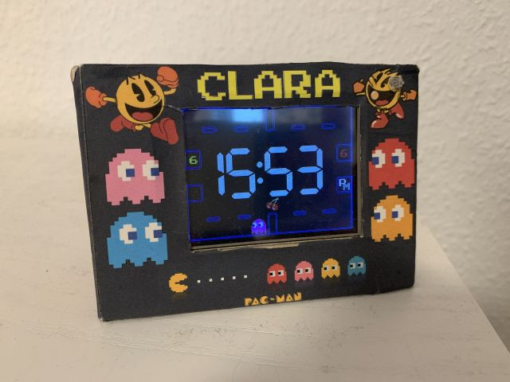
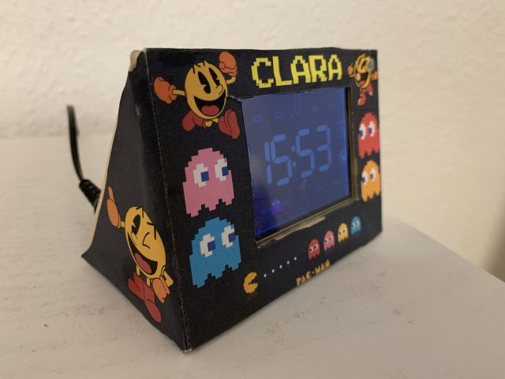
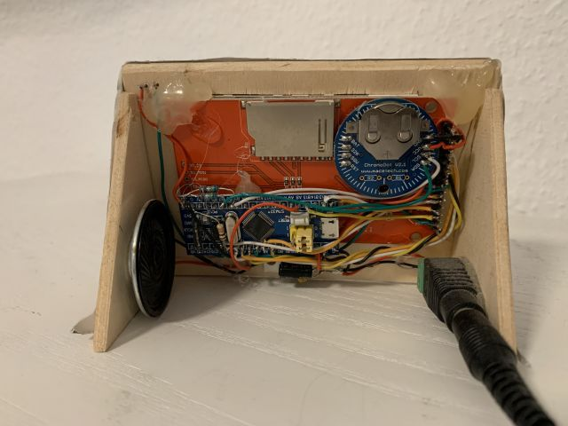

# STM32 based alarm clock with Pac-Man theme.

This is based on [Retro_Pacman_Clock_ESP8266](https://github.com/thomasrunge/Retro_Pacman_Clock_ESP8266), which in turn is a fork of the famous [Pac-Man clock](https://www.instructables.com/Retro-Pac-Man-Clock/) featured at [Instructables](https://www.instructables.com/). As the STM32 has no Wifi, I put a DS3232 real time chip on it. 

STM32-port released 2018-05-14

alarm clock running for years now on my daughters bedside table:

